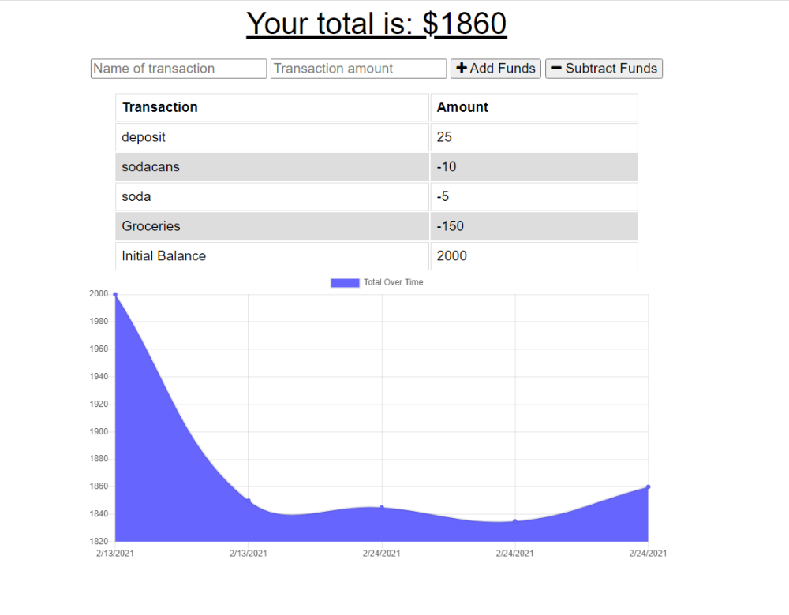

# Budget_Tracker

# Description

<!-- Some wording taken from instructions readme -->

An application that allows the user to add expenses and deposits to their budget with or without a connection. When entering transactions offline, they should populate the total when brought back online. This app gives users a fast and easy way to track their money and allows them to access that information anytime.

## Screenshot

## Deployed App

[Deployed_App](https://online-offline-budget-manager.herokuapp.com/)

## Table of Contents

[Installation](#Installation)

[Usage](#Usage)

[Questions](#Questions)

## Installation

Deployed on Heroku.

## Usage

<!-- Taken from instructions README -->

Offline Functionality:

- Enter deposits offline

- Enter expenses offline

When brought back online:

- Offline entries should be added to tracker.

## Questions

Contact me with any feedback or questions through GitHub or by email.

- [GitHub](https://github.com/smanter82)

- Email: sarahmanter@gmail.com

Some code on this application may have been done in collaboration with my Bootcamp study group classmates: https://github.com/arensalmela, https://github.com/dmaysteinman, https://github.com/EddiePhi, https://github.com/ReindeerCode, https://github.com/DustinErwin, https://github.com/Ewager1, https://github.com/mdjonestwo, https://github.com/shannonquinn91/Note-Taker, https://github.com/JesalDM
